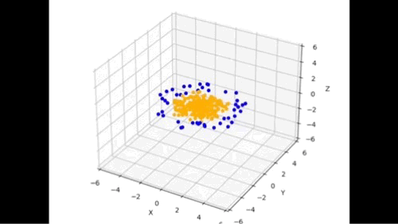
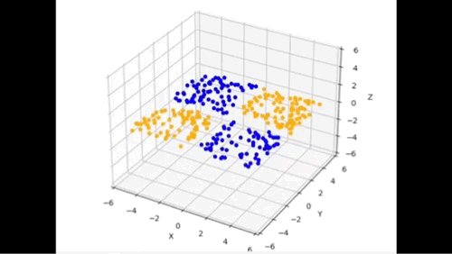
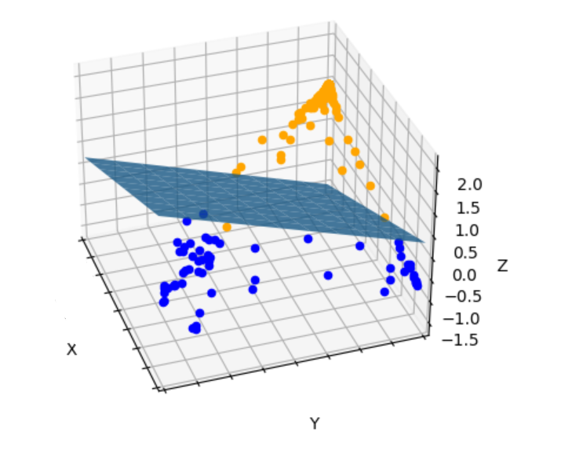

# Animated Neural Networks

Visualize how neural networks transform Euclidean space to make complex 3D data linearly separable

This repository provides an insightful exploration of how neural networks transform Euclidean space to create complex, linearly separable decision boundaries. It includes scripts for generating datasets, training a neural network, and visualizing transformations, offering a deeper understanding of neural network behavior.

## Detailed Summary of the Codebase

This repository comprises a suite of Python scripts designed to visualize how neural networks transform data. The key components include:

- **dataset.py**: Creates synthetic datasets like XOR and circular patterns, which are used to demonstrate the neural network's learning capabilities.
- **interpolate.py**: Provides functions for interpolating points between transformations, aiding in the visualization of the neural network's decision-making process.
- **main.py**: Serves as the main script to run the visualization, orchestrating the generation of datasets, training of the neural network, and the visualization process.
- **matrix_multiplication.py**: Demonstrates matrix multiplication and forward propagation through a neural network, illustrating the mathematical operations involved.
- **model.py**: Defines and trains a multi-layer perceptron (MLP) classifier, which is used to learn from the datasets and make predictions.
- **plot.py**: Contains functions to plot decision surfaces, animate scatter plots, and visualize the transformation of data points through the neural network.
- **transform_forward.py**: Handles the forward transformation of data points using the trained neural network's weights and biases, showing how input data is transformed.
- **transform_inverse.py**: Manages inverse transformations, illustrating how transformed data can be mapped back to the original input space.
- **transformations.py**: Provides various transformation functions, including affine and nonlinear transformations, which are essential for understanding the neural network's behavior.

These scripts collectively demonstrate the complex process of how neural networks learn to separate data in high-dimensional space, making the decision boundaries and transformations visually accessible.

## Code Files Description

- `dataset.py`: Contains code for generating and managing datasets used in the neural network visualizations.
- `interpolate.py`: Provides functionality for interpolating between points in the neural network's decision space.
- `math_utils.py`: Includes mathematical utilities and functions used in the visualizations.
- `model.py`: Defines the neural network model and its architecture.
- `plot.py`: Contains code for plotting and visualizing the neural network's decision boundaries and transformations.
- `transform_forward.py`: Handles forward transformations of the neural network's decision space.
- `transform_inverse.py`: Manages inverse transformations of the neural network's decision space.
- `transformations.py`: Provides various transformation functions used in the visualizations.
